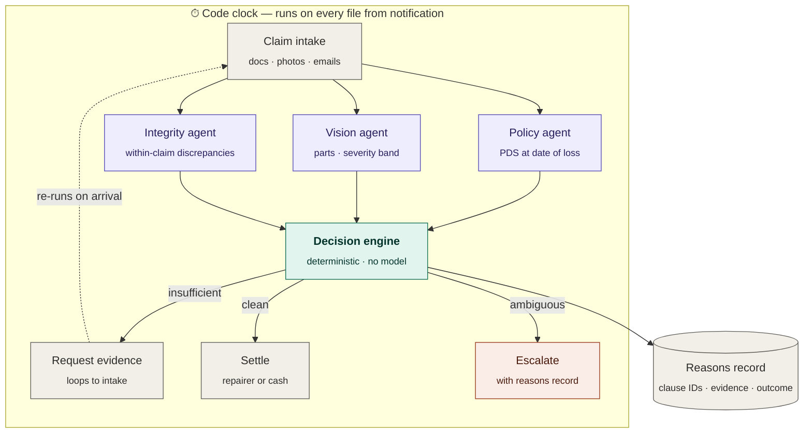

<div align="center">

# VERDICT

**An autonomous claims agent for Australian general insurance.**
Processes routine claims from first notification to settlement. Escalates the rest with a reasons record a human can act on in ninety seconds.

[](https://github.com/mowlya-m/verdict/actions/workflows/ci.yml)
[](https://www.python.org/downloads/)
[](LICENSE)
[](https://github.com/astral-sh/ruff)

[Live demo](https://verdict-claims.vercel.app) · [Architecture](docs/architecture.md) · [Decision records](docs/adr) · [Contributing](CONTRIBUTING.md)

</div>

---

## The problem

Australian insurers received 36,022 general insurance complaints through AFCA in 2025–26, up 5% on a year that was itself up 17%. The Code Governance Committee recorded 70,325 code breaches in 2024–25, a 20.5% rise. The top three complaint issues were claim delay, service quality and claim rejection.

The detail that defines this product: **more than half of the insurers who breached claims-handling timeframes could not say by how many days they had kept customers waiting.**

Under the redrafted General Insurance Code of Practice, those commitments become legally enforceable as part of consumer contracts, and a claim left undecided after twelve months is automatically accepted. ASIC has named claims handling a 2026 enforcement priority.

VERDICT is built for that. Not "assess claims faster" — **own the file, and never let a deadline pass unmeasured.**

## The pipeline



### The one rule that makes it defensible

> **Agents return evidence. The engine returns verdicts. Nothing else does.**

The policy agent returns clause `7.2`. It never returns `"covered"`. The vision agent returns `rear bumper, moderate`. It never returns `"approve"`. The integrity agent returns discrepancies. It never returns `"fraud"`.

The moment a language model produces the outcome, the decision stops being reproducible and the reasons record stops being worth anything in a dispute. See [ADR-0002](docs/adr/0002-deterministic-decision-engine.md).

| Layer | Job | Implementation |
|---|---|---|
| Intake | Extract structured facts from unstructured evidence | LLM |
| Policy | Retrieve clause IDs and text for the PDS in force | RAG |
| Vision | Identify damaged parts and a severity band | VLM |
| Integrity | Surface discrepancies within the claim | Pure Python |
| **Decision** | **Produce the outcome** | **Pure Python, no model** |
| Comms | Write the letter | LLM |

### Five outcomes, not two

| Outcome | When | Why it exists |
|---|---|---|
| `ACCEPT` | Every gate clear, quantum under ceiling | The 60–70% that shouldn't need a person |
| `PARTIAL` | Covered in part | Different legal consequence to a decline |
| `DECLINE` | Not in force, no insuring clause, or an exclusion bites | Needs a reasons record built for AFCA |
| `REQUEST_EVIDENCE` | Cannot decide yet | **The one most designs omit.** Waiting on the claimant is the largest single driver of delay complaints |
| `ESCALATE` | Integrity flags, vulnerability signals, high value, undeterminable damage | A success state, not a failure |

Integrity flags never auto-decline. The engine surfaces, a human decides. An agent that alleges fraud is a defamation problem no compliance officer will sign off — see [ADR-0003](docs/adr/0003-integrity-not-fraud.md).

## Two product lines

Motor and home run on `engine.decide()`. Private health runs on
`health_engine.decide_health()`. Same contract, same five outcomes, same
reasons record. Different gates, because the questions differ.

| | Motor and home | Private health |
|---|---|---|
| 1 | Policy in force at date of loss | Membership active on the day of service |
| 2 | Peril falls within an insuring clause | Tier covers the clinical category |
| 3 | No exclusion applies | Waiting period served |
| 4 | Evidence sufficient to decide | Pre-existing condition assessed |
| 5 | Integrity checks | Hospital agreement in place |
| 6 | Quantum within auto-settle ceiling | Annual limit not exhausted |
| 7 | No vulnerability signals | No vulnerability signals |

Health is the better fit for a rules engine, because almost none of it is a
matter of judgement. Since April 2019 the Commonwealth maps 38 clinical
categories across Gold, Silver, Bronze and Basic, so "does this product cover a
knee replacement" is a lookup rather than an opinion. Waiting periods are capped
by statute: twelve months for a pre-existing condition, twelve for pregnancy,
two for everything else. A fund may waive them; it cannot extend them.

**The rule that shapes the whole health engine:** a pre-existing condition is
determined by a medical practitioner appointed by the insurer, not by the fund
and certainly not by software. So a PEC signal always produces `ESCALATE` and
never `DECLINE`, even when the waiting period has also failed. Getting that
backwards is not a bug, it is a breach.

## Repository layout

```
verdict/
├── apps/
│   ├── api/                  FastAPI service + the decision core
│   │   ├── src/verdict/
│   │   │   ├── schemas.py    Claim record, gates, reasons record
│   │   │   ├── engine.py     Seven gates, five outcomes, zero model calls
│   │   │   ├── integrity.py  Within-claim discrepancy checks
│   │   │   ├── clock.py      Code of Practice deadline calculator
│   │   │   ├── agents/       LLM/RAG/VLM layers (evidence only)
│   │   │   └── api/          FastAPI routers
│   │   └── tests/
│   └── web/                  Vite + React assessor console
├── eval/                     AFCA determination harness
├── docs/
│   ├── architecture.md
│   └── adr/                  Architecture decision records
└── .github/                  CI, labels, templates
```

## Quickstart

```bash
git clone https://github.com/mowlya-m/verdict.git && cd verdict
make setup          # api deps + web deps
make test           # pytest + vitest
make dev            # api on :8000, web on :5173
```

On macOS with Anaconda, the Makefile respects `PYTHON=/opt/anaconda3/bin/python3.12`.

## Measurement

The claim that matters isn't "it works," it's "here is how often it agrees with an adjudicator."

`eval/` scrapes published AFCA determinations, strips the outcome, feeds the facts and policy grounds through `decide()`, and reports:

| Metric | Definition | Target |
|---|---|---|
| **Agreement rate** | Outcome matches AFCA's determination | > 85% |
| **Escalation precision** | Of escalated files, share AFCA overturned the insurer on | High is good |
| **False confidence** | Confidently decided, AFCA overturned | **≈ 0** |

There is no confidence percentage anywhere in this system. The reasons record shows which gates passed and which clause was relied on, which is inspectable. A fabricated `94%` is not. See [ADR-0004](docs/adr/0004-no-confidence-scores.md).

## Deliberately absent

- **No repair cost model.** There is no free source of Australian trade repair data, so quantum comes from the submitted quote or an explicit estimate band with assumptions shown. Training a regressor on synthetic repair data would be the fastest way to lose an insurance buyer in Q&A.
- **No claims-history fraud model.** No customer portfolio exists to train it on. Integrity checks operate on a single claim: EXIF timestamps against the stated loss date, perceptual hash collisions, quote line items against visible damage.
- **No knowledge graph.** It demos as a picture and costs a day.

## Licence

MIT. Not legal or financial advice. Code of Practice timeframes in `clock.py` are encoded from public summaries and must be verified against the Code text before any production use.
