# Architecture

  

## The one rule

> **Agents return evidence. The engine returns verdicts. Nothing else does.**

The policy agent returns clause `7.2`. It never returns `"covered"`. The vision
agent returns `rear bumper, moderate`. It never returns `"approve"`. The
integrity agent returns a timestamp discrepancy with a weight. It never returns
`"fraud"`.

The moment a language model produces the outcome, three things break at once.
The decision stops being reproducible, so two identical claims can diverge. The
reasons record becomes a story told afterwards rather than a trace of what
happened. And adding a rule becomes a prompt edit whose effect on three hundred
other cases is unknown.

Enforced at review time by the decision boundary checklist in the pull request
template, and at the HTTP boundary by `test_response_carries_no_confidence_score`.

Full reasoning in [ADR-0002](adr/0002-deterministic-decision-engine.md).

## Layers

| Layer | Job | Model? | Lives in |
|---|---|---|---|
| Intake | Extract structured facts from documents and photos | yes | `agents/` |
| Policy | Retrieve clause identifiers and text | yes, RAG | `agents/` |
| Vision | Identify damaged parts and a severity band | yes, VLM | `agents/` |
| Integrity | Surface within-claim discrepancies | **no** | `integrity.py` |
| Clock | Position against every Code deadline | **no** | `clock.py` |
| **Decision** | **Produce the outcome** | **no** | `engine.py`, `health_engine.py` |
| Transport | Validate, map, serve | **no** | `api/` |
| Comms | Write the letter | yes | `agents/` |

## Two product lines, one contract

`decide()` handles motor and home. `decide_health()` handles private health.
Both return a `ReasonsRecord` with the same five outcomes. The gates differ
because the questions differ.

| | Motor and home | Private health |
|---|---|---|
| 1 | Policy in force at date of loss | Membership active on the day of service |
| 2 | Peril falls within an insuring clause | Tier covers the clinical category |
| 3 | No exclusion applies | Waiting period served |
| 4 | Evidence sufficient to decide | Pre-existing condition assessed |
| 5 | Integrity checks | Hospital agreement in place |
| 6 | Quantum within auto-settle ceiling | Annual limit not exhausted |
| 7 | No vulnerability signals | No vulnerability signals |

## Five outcomes, not two

`ACCEPT` · `PARTIAL` · `DECLINE` · `REQUEST_EVIDENCE` · `ESCALATE`

`REQUEST_EVIDENCE` is the one most designs omit, and it matters most. Waiting on
the claimant is the largest single driver of the claims-handling delay
complaints this product exists to prevent. A file that stalls silently is the
failure mode.

`ESCALATE` is a success state. Integrity flags never auto-decline, and a
possible pre-existing condition never auto-declines, because only a medical
practitioner appointed by the insurer may determine one. Getting that backwards
is not a bug, it is a breach.

## Where the regulatory constants live

One module per domain, never inline in business logic.

| Constant | Module |
|---|---|
| Code decision windows, IDR response | `clock.py` |
| Clinical categories by tier, waiting periods | `health.py` |
| Evidence schedules, auto-settle ceilings | `engine.py`, `health_engine.py` |

Any pull request touching one carries the `compliance` label and must name the
obligation, where it is encoded, and how it is tested.

## Decision records

| # | Title |
|---|---|
| [0001](adr/0001-monorepo-with-workspace-split.md) | Monorepo with an api and web workspace split |
| [0002](adr/0002-deterministic-decision-engine.md) | The decision engine contains no model calls |
| [0003](adr/0003-integrity-not-fraud.md) | Integrity signals, never a fraud verdict |
| [0004](adr/0004-no-confidence-scores.md) | No confidence percentages in decision output |
